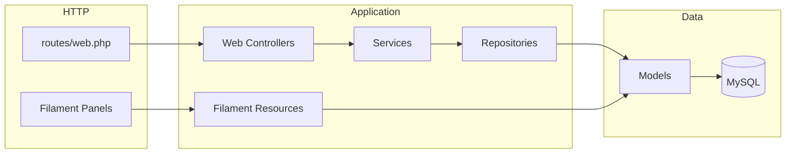

# Architecture

## Overview

Board uses a layered architecture for the public site and direct Eloquent access from Filament resources (with scoping and gate services in Center/Trainer panels).



## Bootstrap providers

Registered in `bootstrap/providers.php`:

| Provider | Role |
|----------|------|
| `AppServiceProvider` | Pagination (Bootstrap 5), Filament language switch, model observers |
| `EloquentServiceProvider` | Eloquent configuration |
| `QueryServiceProvider` | Query macros/scopes |
| `SecurityServiceProvider` | Security-related bindings |
| `ValidationServiceProvider` | Custom validation rules |
| `ArchitectureServiceProvider` | Model property checks on retrieve |
| `PerformanceServiceProvider` | Performance tuning |
| `MacroServiceProvider` | Collection/query macros |
| `RepositoryServiceProvider` | Repository singletons |
| `ServiceRegistrationProvider` | Core domain service singletons |
| `ObserverServiceProvider` | Additional observers |
| `ViewServiceProvider` | Shared Blade data |
| `AdminPanelProvider` | Filament admin |
| `CenterPanelProvider` | Filament center |
| `TrainerPanelProvider` | Filament trainer |

## Service layer

**Registered singletons** (`ServiceRegistrationProvider`):

- `AccreditationRequestService`, `ApplicationSettingService`, `CertificationService`
- `CertifiedCenterService`, `StaticPageService`
- `TrainerService`, `UserService`
- `StatsService`, `CenterStatsService`

**Auto-resolved** (constructor injection, not explicitly registered):

- `BlogPostService`, `HomeService`, `SeoService`, and other web-specific services

## Repository layer

**Registered singletons** (`RepositoryServiceProvider`):

- `AccreditationRequestRepository`, `ApplicationSettingRepository`, `CertificationRepository`
- `CertifiedCenterRepository`, `StaticPageRepository`, `TrainerRepository`
- `UserRepository`, `BlogPostRepository`

Not every model has a repository; Filament and some services use models directly.

## Locale configuration

`App\Support\LocaleConfig` centralizes locale lists for type-safe use in PHP and static analysis:

| Method | Returns |
|--------|---------|
| `availableLocales()` | `list<string>` from `config('app.available_locales')` |
| `isAvailable($locale)` | Whether locale is allowed |
| `defaultLocale()` | App default or first available |

Consumers: `LocaleMiddleware`, `LocaleController`, `ViewServiceProvider` (`availableLocales` shared variable).

## ViewServiceProvider defaults

Before querying the database, the provider shares:

- `navigationPages` → `[]`
- `appSettings` → empty `Collection`

Overwritten when `static_pages` / `application_settings` tables exist. Prevents undefined variable errors in `primary_nav` during fresh installs.

## Cross-cutting concerns

### SEO

`App\Services\Seo\SeoService` — controllers call `setMeta(title, description)` before returning views. Layout reads `$seo` in `layouts/master.blade.php`.

### Observers

| Model | Observer | Effect |
|-------|----------|--------|
| `Certification` | `CertificationObserver` | Cache invalidation |
| `Trainer` | `TrainerObserver` | Home stats cache |
| `CertifiedCenter` | `CertifiedCenterObserver` | Home stats cache |

### Accreditation gates

`AccreditationGateService` — used by Center panel resources to block actions when center is not accredited.

Middleware:

- `EnsureCenterIsAccredited` — Center panel
- `EnsureTrainerIsAccredited` — Trainer panel auth stack

### Policies

Model-attached: `Certification`, `AccreditationRequest`, `CertifiedCenter`, `CenterTypeRequest`.

`AuthServiceProvider`: `Country`, `DocumentType`, `Trainee`, `Trainer`, `User`.

## View composition

```
layouts/master.blade.php
  ├── components/header/primary_nav.blade.php
  ├── @yield('content')
  └── components/footer/main_footer.blade.php
```

**Page pattern (directory listings):**

```
page_header
section.section > container
  ├── filters (optional)
  ├── row > sections/*_list
  └── pagination
```

**Home** (`home_page.blade.php`): composes section components only; data from `HomeService::getHomeData()`.

## Configuration

| File | Purpose |
|------|---------|
| `config/app.php` | App name, `available_locales`, timezone |
| `config/panels.php` | Filament panel id, path, guard, discovery namespaces |
| `config/auth.php` | Guards: `web`, `certified_center`, `trainer` |

Laravel 12 slim `config/app.php` — no `providers` or `aliases` arrays (see `bootstrap/providers.php`).

## Strict typing and Filament v4

- All new PHP uses `declare(strict_types=1)`
- Filament resources use `Filament\Schemas\Schema` with dedicated `configure()` classes
- Tables live in `Tables/*Table.php`, forms in `Schemas/*Form.php`

## Public vs admin boundaries

| Concern | Public web | Filament |
|---------|------------|----------|
| Auth | None (read-only site) | Panel guards |
| Writes | None | Full CRUD per resource |
| Scoping | Active/published filters in services | Center/Trainer scoped queries |
