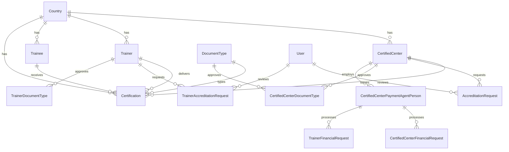

# Data model

## Entity relationship (core domain)



## Models (20)

### Auth & accounts

| Model | Table | Auth | Notes |
|-------|-------|------|-------|
| `User` | `users` | Admin panel | `UserType` enum; reviews accreditations |
| `CertifiedCenter` | `certified_centers` | Center panel | `CenterStatus`; accreditation dates |
| `Trainer` | `trainers` | Trainer panel | `unique_trainer_code`, JSON address/specializations |

### Reference data

| Model | Translatable | Notes |
|-------|--------------|-------|
| `Country` | `name`, `nationality` | `code`, `code_2`, `is_active` |
| `DocumentType` | `name` | `key`; linked to certifications |
| `ApplicationSetting` | — | `SettingType` cast; static `get`/`set` |

### Core records

| Model | Key fields | Relations |
|-------|------------|-----------|
| `Trainee` | profile, `country_id`, `date_of_birth` | `country`, `certifications` |
| `Certification` | `accredited_serial_number`, `document_code`, `accreditation_number`, FKs | `certifiedCenter`, `trainee`, `trainer`, `documentType`, `country` |

### Workflows

| Model | Status enum | Purpose |
|-------|-------------|---------|
| `AccreditationRequest` | `AccreditationStatus` | Center accreditation lifecycle |
| `TrainerAccreditationRequest` | `AccreditationStatus` | Trainer accreditation lifecycle |
| `CenterTypeRequest` | `CenterTypeRequestStatus`, `CenterTypeRequestType` | Center type/document requests |
| `CenterDocumentTypeRequest` | `DocumentTypeRequestStatus` | Bulk document type approval |
| `TrainerDocumentTypeRequest` | `DocumentTypeRequestStatus` | Trainer document type approval |
| `CertifiedCenterDocumentType` | — | Pivot; `is_published` |
| `TrainerDocumentType` | — | Pivot for trainer approvals |

### Financial

| Model | Notes |
|-------|-------|
| `CertifiedCenterPaymentAgentPerson` | Agent linked to center |
| `CertifiedCenterFinancialRequest` | `remaining_amount` appended accessor |
| `TrainerFinancialRequest` | Same pattern for trainers |

### CMS

| Model | Translatable | Public |
|-------|--------------|--------|
| `BlogPost` | `title`, `excerpt`, `content` | `is_published`, `published_at`; `image_url` accessor |
| `StaticPage` | `title`, `content` | `slug`, `is_active`; drives nav pages |

## Enums (`app/Enums`)

| Enum | Cases |
|------|-------|
| `AccreditationStatus` | pending, approved, rejected, under_review |
| `CenterStatus` | active, inactive, pending, suspended |
| `UserType` | admin, client |
| `DocumentTypeRequestStatus` | pending, approved, rejected |
| `CenterTypeRequestStatus` | pending, approved, rejected |
| `CenterTypeRequestType` | course, document_type |
| `SettingType` | text, number, boolean, json, email, url |
| `PanelId` | admin, center |

## Media accessors

| Model | Accessor | Storage field |
|-------|----------|---------------|
| `Trainer` | `avatar_url` | `avatar` |
| `CertifiedCenter` | `logo_url` | logo path column |
| `BlogPost` | `image_url` | `image` |

## Certification lookup (public web)

Public verification uses `accredited_serial_number` or `document_code` via `CertificationService::getBySerial()`. Route parameter `{serial}` maps to this lookup.

## Translatable pattern

Models using `Spatie\Translatable\HasTranslations`:

```php
public array $translatable = ['title', 'content']; // per model
```

Locale from `app()->getLocale()`; fallback via `config('app.fallback_locale')`.

## Policies

| Model | Policy |
|-------|--------|
| `Certification` | `CertificationPolicy` |
| `AccreditationRequest` | `AccreditationRequestPolicy` |
| `CertifiedCenter` | `CertifiedCenterPolicy` |
| `CenterTypeRequest` | `CenterTypeRequestPolicy` |

Filament authorization also uses resource `can*()` overrides and middleware on Center/Trainer panels.
