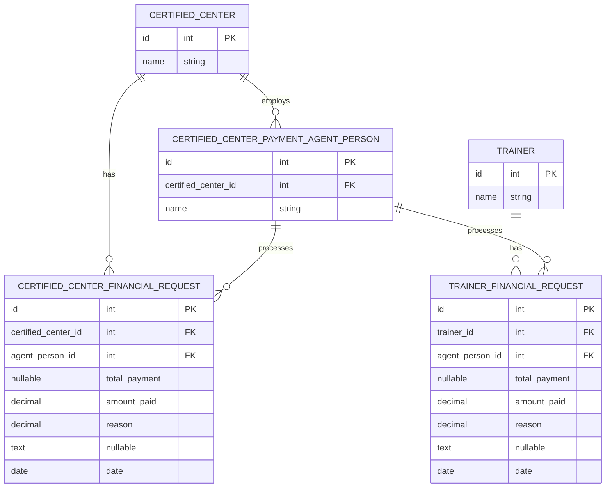
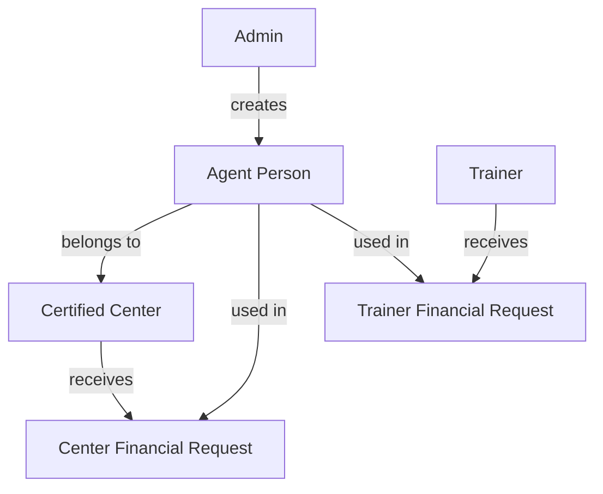
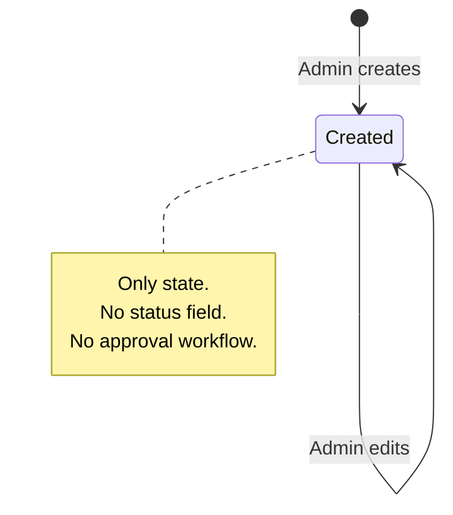
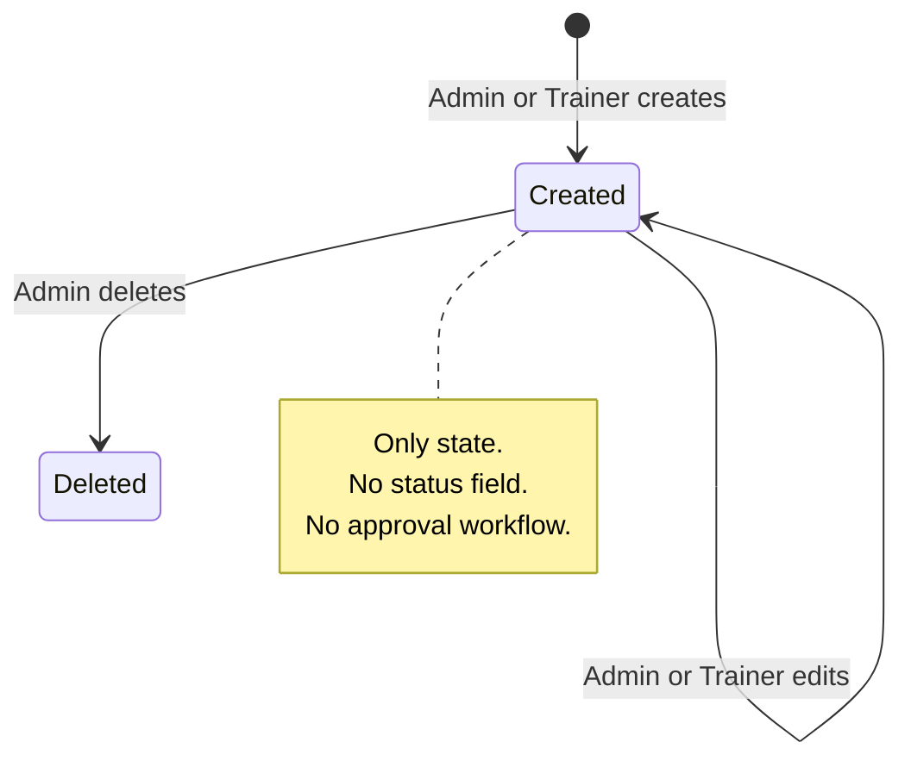

# Financial Management Workflow Documentation

## Overview

The financial management module tracks payments between the International Board, Certified Centers, and Trainers. It consists of three entities:

1. **Payment Agent Persons** — individuals at certified centers who process financial transactions
2. **Center Financial Requests** — payment records for certified centers
3. **Trainer Financial Requests** — payment records for trainers

Three Filament panels interact with these entities: **Admin**, **Center**, and **Trainer**.

---

## Entity Relationship Diagram

---

## 1. Payment Agent Workflow

### 1.1 Admin Perspective

Admin has **full CRUD** on payment agent persons.

| Action | Available | Notes |
|--------|-----------|-------|
| List | Yes | `/admin/payment-agent-persons` |
| Create | Yes | Fields: `name` (required), `certified_center_id` (required, searchable Select) |
| View | Yes | Shows name, email, phone, is_active (infolist) |
| Edit | Yes | Same fields as create |
| Delete | Yes | Cascade deletes all linked financial requests |

### 1.2 Center Perspective

**No access.** Center panel has no resource for payment agent persons.

### 1.3 Trainer Perspective

**No access.** Trainer panel has no resource for payment agent persons.

### 1.4 Data Flow

---

## 2. Center Financial Request Workflow

### 2.1 Creation Flow

**Only Admin can create center financial requests.**

| Step | Who | Action | Fields |
|------|-----|--------|--------|
| 1 | Admin | Opens create form | — |
| 2 | Admin | Selects certified center | `certified_center_id` (required, searchable) |
| 3 | Admin | Selects agent person | `agent_person_id` (required, filtered by center, with server-side validation) |
| 4 | Admin | Enters payment details | `total_payment` (required, min 0.01), `amount_paid` (required, 0 to total_payment) |
| 5 | Admin | Adds notes | `reason` (optional) |
| 6 | Admin | Sets date | `date` (required, default today, cannot be future) |
| 7 | System | Saves record | Redirects to view page |

### 2.2 Center View

Center panel shows **read-only** view of their own financial requests.

| Aspect | Behavior |
|--------|----------|
| Query scope | `->where('certified_center_id', auth('certified_center')->id())` |
| Pages available | List + View only (no Create, no Edit) |
| Form fields | All disabled (agent, total, paid, remaining, date, reason) |
| Actions | None |

### 2.3 Approval Flow

**No approval workflow exists.** There is no `status` field on the model. Records are created and immediately visible.

### 2.4 Payment Flow

**No payment tracking beyond initial creation.** The `amount_paid` is set at creation time. There is no mechanism to record partial payments over time.

### 2.5 State Diagram (Current)

---

## 3. Trainer Financial Request Workflow

### 3.1 Creation Flow

**Both Admin and Trainer can create trainer financial requests.**

#### Admin Creates

| Step | Who | Action | Fields |
|------|-----|--------|--------|
| 1 | Admin | Opens create form | — |
| 2 | Admin | Selects trainer | `trainer_id` (required, searchable Select) |
| 3 | Admin | Selects agent person | `agent_person_id` (required, grouped by center) |
| 4 | Admin | Enters payment details | `total_payment` (required, min 0.01), `amount_paid` (required, 0 to total_payment) |
| 5 | Admin | Adds notes | `reason` (optional) |
| 6 | Admin | Sets date | `date` (required, default today, cannot be future) |
| 7 | System | Saves record | Redirects to view page |

#### Trainer Creates

| Step | Who | Action | Fields |
|------|-----|--------|--------|
| 1 | Trainer | Opens create form | — |
| 2 | Trainer | Selects agent person | `agent_person_id` (required, grouped by center) |
| 3 | Trainer | Enters payment details | `total_payment` (required), `amount_paid` (required, **no max constraint**) |
| 4 | Trainer | Adds notes | `reason` (optional) |
| 5 | Trainer | Sets date | `date` (required) |
| 6 | System | Injects `trainer_id` | `mutateFormDataBeforeCreate` sets `trainer_id = auth('trainer')->id()` |
| 7 | System | Saves record | Redirects to view page |

### 3.2 Trainer View

Trainer panel shows **full CRUD** for their own financial requests.

| Aspect | Behavior |
|--------|----------|
| Query scope | `->where('trainer_id', auth('trainer')->id())` |
| Pages available | List, Create, View, Edit |
| Table actions | View, Edit, Delete per row |
| Form | Agent, total, paid, date, reason |

### 3.3 Approval Flow

**No approval workflow exists.** Same as center requests — no `status` field.

### 3.4 State Diagram (Current)

---

## 4. Cross-Panel Permission Matrix

| Action | Admin | Center | Trainer |
|--------|-------|--------|---------|
| **Payment Agent Person** | | | |
| Create Agent | Yes | No | No |
| Edit Agent | Yes | No | No |
| Delete Agent | Yes | No | No |
| View Agents | Yes | No | No |
| **Center Financial Request** | | | |
| Create Request | Yes | **No** | N/A |
| Edit Request | Yes | No | N/A |
| Delete Request | Yes | No | N/A |
| View Requests | All | Own only | N/A |
| **Trainer Financial Request** | | | |
| Create Request | Yes | N/A | Yes |
| Edit Request | Yes | N/A | Yes (own) |
| Delete Request | Yes | N/A | Yes (own) |
| View Requests | All | N/A | Own only |

---

## 5. Key Observations

### 5.1 Admin Creates, Center Views (Center Requests)

The center financial request workflow is **admin-driven**:
- Admin selects the center, agent, enters amounts
- Center can only view what admin created for them
- Center has no ability to create, edit, or dispute

### 5.2 Dual Creation (Trainer Requests)

Trainer financial requests can be created by:
- **Admin** — manually selects trainer + agent
- **Trainer** — agent only (trainer_id auto-injected)

### 5.3 Agent Person as Bridge

Agent persons connect financial requests to centers:
- Each agent belongs to exactly one center
- Financial requests reference an agent (nullable)
- Agent deletion cascades to center, which cascades to financial requests

### 5.4 No Financial Lifecycle

Both financial request types have **no status field, no approval workflow, no payment schedule**. A record is created with `total_payment` and `amount_paid` at the same time — there is no concept of "pending payment" or "partial payment over time."
